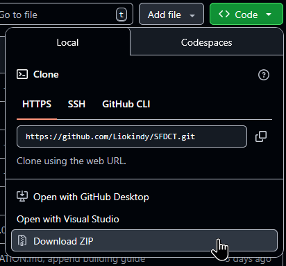
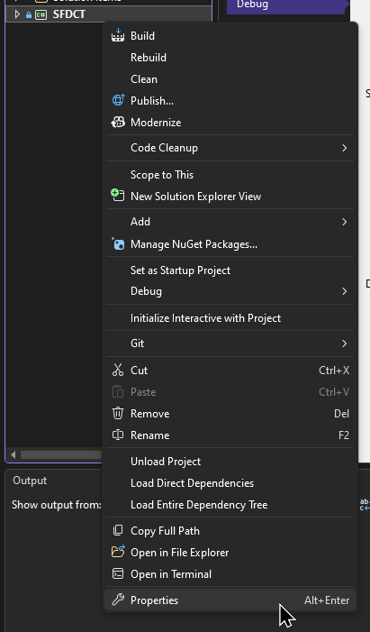
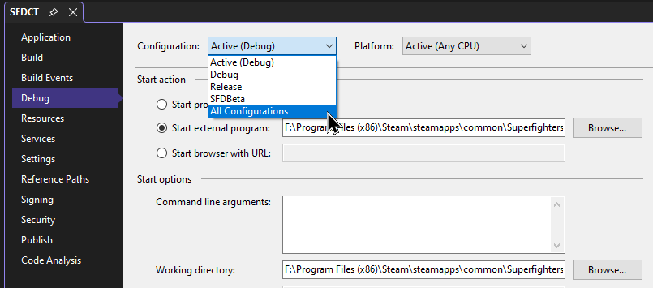
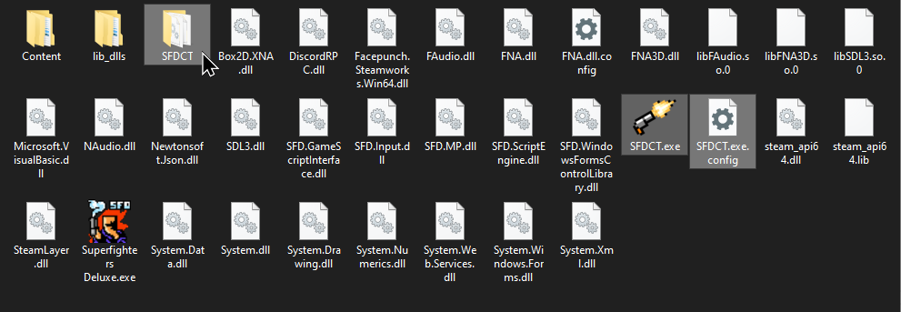

# CONTRIBUTING

## Idioma

- [](CONTRIBUTING.md)
- [](CONTRIBUTING.es.md)

## Compilación

Necesitarás:
- Experiencia con C# y Reflection.
- [Visual Studio](https://visualstudio.microsoft.com/) con ".NET Desktop development" y el SDK de .NET Framework 4.7.2 instalado.
- [dnSpy](https://github.com/dnSpyEx/dnSpy)

### 1. OBTENER LOS ARCHIVOS DEL REPOSITORIO

Puedes descargarlos manualmente en "code" -> "download ZIP", o clonarlos usando Git o GitHub Desktop.

<p></p>

### 2. CONFIGURAR LA SOLUCIÓN

- Abre el archivo de solución (`.sln`) con Visual Studio.
- Espera a que NuGet instale todas las dependencias.
- Haz clic derecho en `SFDCT` y selecciona propiedades.

<p></p>

- Ve a la pestaña "debug" en el costado y cambia tu configuración a "all configurations".
- Ve a tu instalación de Superfighters Deluxe, copia y pega `Superfighters Deluxe.exe` para crear un archivo dummy, renómbralo a `SFDCT.exe`.
- En "start action" cambia a "start external program", navega al archivo dummy que creaste y selecciónalo, por ejemplo: `C:\Program Files (x86)\Steam\steamapps\common\Superfighters Deluxe\SFDCT.exe`.
- En "start options" cambia el directorio de trabajo a la carpeta raíz de tu instalación de Superfighters Deluxe, por ejemplo: `C:\Program Files (x86)\Steam\steamapps\common\Superfighters Deluxe\`.

<p></p>

> [!NOTE]
>
> Si instalaste Superfighters Deluxe en otro directorio o disco, debes modificar `build.bat`.
> - Cambia la variable `SFD` con la tuya, por ejemplo: `SET SFD="C:\Program Files (x86)\Steam\steamapps\common\Superfighters Deluxe"`
> 

### 3. CONFIGURAR SFDCT

- Ve a tu instalación de Superfighters Deluxe y crea una carpeta `SFDCT`.
- Regresa a los archivos del repositorio y copia estos a la carpeta que creaste:
- - Carpeta `Content`
- - Archivo `Core.dll` dentro de `SFD`.

<p></p>

### 4. COMPILAR Y PROBAR

En Visual Studio intenta compilar la solución, puedes usar el botón "build solution" en el menú "build" en la barra superior o usar `Ctrl + Shift + B`. Si no ves errores y aparecen mensajes de archivos siendo copiados en la salida: ¡Lo lograste, bien hecho!

Abre `Core.dll` con dnSpy para inspeccionar el código de SFD, la forma principal de modificar el comportamiento es mediante parches de Harmony. Puedes aprender más [sobre cómo aplicar parches en esta guía oficial de Harmony](https://harmony.pardeike.net/articles/patching.html), y también sobre [parches transpiler de Harmony con esta guía de Terraria](https://gist.github.com/JavidPack/454477b67db8b017cb101371a8c49a1c).

> [!TIP]
>
> - Hay algunas configuraciones de SFD que puedes cambiar para que la carga inicial sea más rápida, como la resolución o desactivar la música.
> - Puedes usar el depurador de Visual Studio adjuntándolo al proceso `SFDCT.exe`.
> 

## Localización

SFDCT usa el mismo sistema que SFD para los idiomas: los textos específicos de cada idioma se almacenan en un archivo, referenciados con IDs y formateados con argumentos dados por el juego.

Aquí un fragmento del archivo de idioma `SFDCT_default.xml` de SFDCT:

```xml
<Texts name="Default">
    <!--  ...  -->
    <Text id="sfdct.command.servermouse.message">Server-Mouse configurado a {0}</Text>
    <Text id="sfdct.command.servermousemoderators.message">Moderadores de Server-Mouse configurados a {0}</Text>
    <Text id="sfdct.command.addmodcommands.header">Agregando comandos de moderador...</Text>
    <!--  ...  -->
</Texts>
