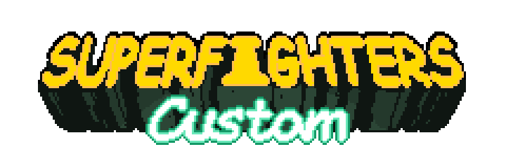
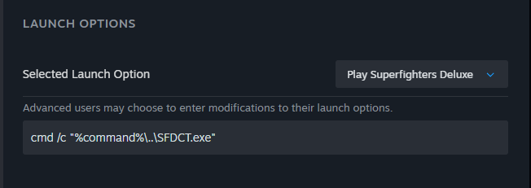
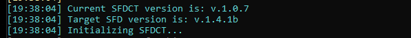

# SFDCT

## Lenguaje

- 
- 

--- 

> [!CAUTION]
> 
> SFDCT puede ser detectado como un *programa malicioso*. Este es un problema conocido.
>
> ***NO*** descargues SFDCT desde fuentes que no sean las [***RELEASES***](https://github.com/Liokindy/SFDCT/releases) del repositorio oficial.
>
> Si tienes dudas, puedes revisar manualmente el código fuente y compilar SFDCT en tu propia PC.

Superfighters Custom es un addon para [Superfighters Deluxe](https://store.steampowered.com/app/855860/Superfighters_Deluxe). Agrega y ajusta algunas funciones mientras mantiene compatibilidad con la versión original de SFD. Esto significa que un jugador puede unirse a un servidor normal de SFD usando SFDCT, y jugadores con la versión normal de SFD pueden unirse a un servidor alojado con SFDCT.

    
¿Por qué "SFDCT"? ¿Por qué no "SFDC" o "SFC"?

*Sí, se llama "Superfighters CusTom" y se abrevia "SFDCT", no "SFDC" ni "SFC". [ou wonder who did that? Me. I voted for it](https://youtu.be/981BU3u5imU?t=63). Originalmente, créelo o no, se eligió para que no sonara como un mod grande e importante (¡wow, es SFC!), y para no usar el nombre del script ["SFDC" de Odex](https://steamcommunity.com/sharedfiles/filedetails/?id=2379236732). El equipo de SFDCT NO debe ser considerado responsable de cualquier confusión en este asunto, ya que esperamos que nuestros esfuerzos sean suficientes para diferenciarnos de esas creaciones originales. A estas alturas, me he encariñado con el nombre; sí, técnicamente está mal, pero eso le da un poco de encanto, ¿no?*

## Instalación

> [!IMPORTANT]
> 
> Las versiones de SFDCT funcionarán ***únicamente*** en la versión de SFD especificada para esa release, cualquier otra versión de SFD puede ***no*** funcionar.

1. **DESCARGAR UNA RELEASE**

Puedes obtener la [última versión **estable**](https://github.com/Liokindy/SFDCT/releases/latest), o revisar si existe una [última **pre-release**](https://github.com/Liokindy/SFDCT/releases). Extrae el contenido en la carpeta de Superfighters Deluxe.

2. **OPCIONES DE LANZAMIENTO**

Dentro de Steam, ve a `Propiedades...` de Superfighters Deluxe -> `OPCIONES DE LANZAMIENTO` y copia estas opciones:

    
    cmd /c "%command%\..\SFDCT.exe"

3. **ABRIR SFD**

Cuando abras Superfighters Deluxe, se abrirá una consola, dentro deberías ver texto en colores.

## Créditos

#### SFDCT

- Azure (Ideas)
- ElDou's1 (Ideas, Tester)
- Liokindy (Desarrollador)
- Nult (Ideas)

#### AGRADECIMIENTOS ESPECIALES
- Desarrolladores de [Superfighters Redux](https://github.com/Odex64/SFR)
- Desarrolladores originales de [Superfighters Deluxe](https://mythologicinteractive.com/SuperfightersDeluxe)
