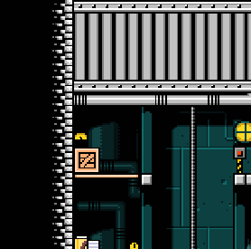
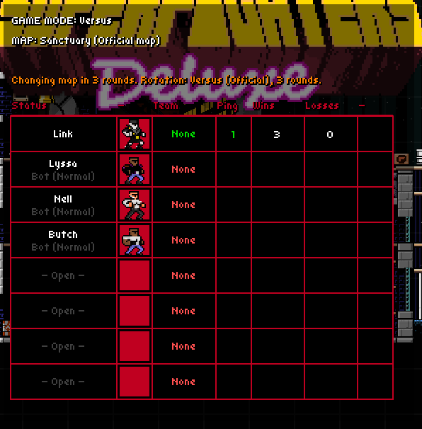
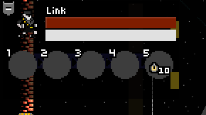
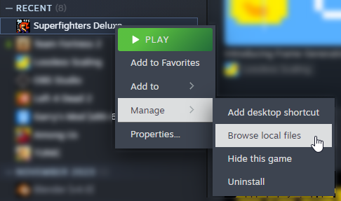
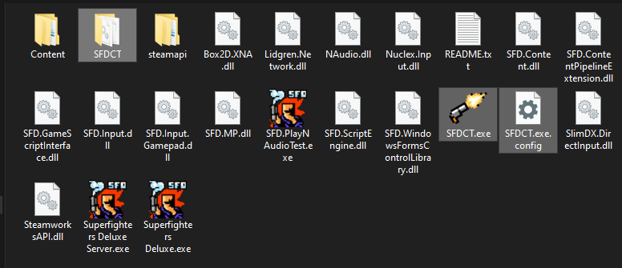
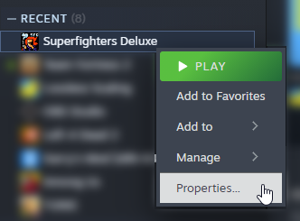
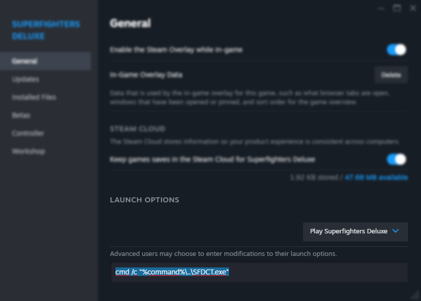

My own **modification** for [Superfighters Deluxe](https://store.steampowered.com/app/855860/Superfighters_Deluxe), using [Superfighters Redux](https://github.com/Odex64/SFR) as base. It tweaks and adds some features I personally like to SFD.

# - Current Features -
> [!TIP]
> These can be further configured and tweaked in the configuration ini file. (`config.ini`)

> [!NOTE]
> The mod is still a work-in-progress. Features may break, be added, removed, or changed entirely.

### Enhanced Sound System (Panning)
Sounds will come from the left or right depending on where they originate from.
- If **screen-space**, it will depend on how close they are to the edges of the screen. If following your **in-game fighter**, it will depend to what side they are from you, and how far away they are.
- Sounds can slow down or speed up accordingly depending on the current speed of time, making slow-motions even more chaotic and cinematic.

### Vote-Kick System
You can now start a vote-kick in-game without using extension scripts. (This can be disabled and altered in the configuration file)
- It will appear on the side of screen like a map-vote for everyone in the server.
- Players can provide a short reason on why they want to vote-kick that player, such as being toxic or ruining the game.

### Miscellaneous
- Choose your own color for the UI.

- Choose what color your player blinks at the start of a round.
- Use your mouse to drag opponents and objects around. (This is already a feature in SFR)
- Your HUD now features a blue bar, your "omen-bar". This bar (for now) is only useful to know how much time remaining your own slow-motions have.

# How to install
1. Get the latest release [here](https://github.com/Liokindy/SFDCT/releases). Go to SFD in Steam, right-click it, go to "Manage", and then "Browse local files". Extract the zip contents in there.

3. Next, go back to Steam and right-click SFD, then "Properties...". Go to launch options, and type `/k "%command%\..\SFDCT.exe"`. This will tell Steam to open SFDCT in a cmd instead of SFD directly.

3. When you open SFD, it will launch as SFDCT. You should be good to go!

# F.A.Q.
### **IMPORTANT** - SFDCT got flagged as a malicious app/file
> [!WARNING]
> Sadly this is a **known** problem, most people can download and launch SFDCT just fine, however, on some cases it may get flagged as being a **malicious app** by your browser and/or OS.

Due to this, if SFDCT gets flagged on your end, you'll have to create an exception for it. We're sorry for this issue.

### What is this?
A fork of [SFR](https://github.com/Odex64/SFR), stripped from everything and with some features on top. Can host and connect to **vanilla** SFD servers. (Players with or without SFDCT can still join)

### How does it work?
Code is patched, modified and added through reflection and [HarmonyLib](https://harmony.pardeike.net/).

# License
> The **Superfighters Redux** mod is allowed to **adapt and modify Superfighters Deluxe** and it's content to allow for **other mod integration that is not Superfighters Redux.**

SFDCT is a fork of [SFR](https://github.com/Odex64/SFR). You can read the [SFR license file](https://github.com/Odex64/SFR/blob/master/LICENSE.txt) for further clarification and details.

# How to Build
You can follow [SFR's building guide](https://github.com/Odex64/SFR/blob/master/CONTRIBUTE.md), as the process is quite similar, if not the same for both.
