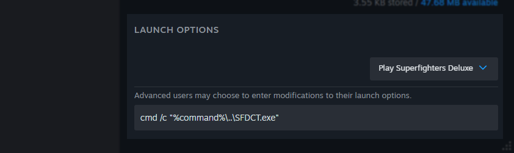
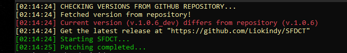
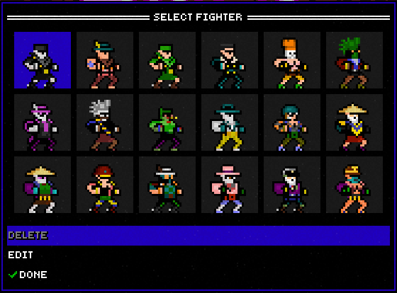
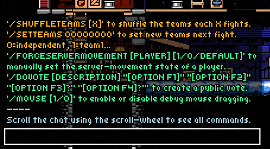

# IMPORTANT
> [!WARNING]
> SFDCT will **NOT** work in any other version that is not `1.3.7d`

I'm working to get SFDCT to work on SFD 1.4.1. Most of the features will have to get removed as they are officially implemented, and I don't know if I will get it to work.

But there's still hope.

# SFDCT
SFDCT is my mod for [Superfighters Deluxe](https://store.steampowered.com/app/855860/Superfighters_Deluxe). It adds some stuff me and my friends want in vanilla SFD.

- Players with vanilla-SFD can join an SFDCT server, and if you use SFDCT you can join vanilla-SFD servers!

> [!NOTE]
> This mod is in development, so some features may be added, removed, or changed

> [!TIP]
> The settings file is located at `Superfighters Deluxe\SFDCT\config.ini`, you can edit it with a text editor and then refresh your settings in-game using `F6`. However. In some cases you may need to restart the game

# CREDITS

*Special thanks to my friends, `Nult`, `ElDou's1`, and `Azure`, who help me develop this mod by providing me with ideas and emotional support! :3 <3*

SFDCT is based on [Superfighters Redux](https://github.com/Odex64/SFR), and was made using it as a base, however, assets and features from SFR are not included. (But SFR servers will have a unique pink color on the server-browser!)

# INSTALLATION
> [!WARNING]
> SFDCT may get flagged as malicious by you OS or Anti-Virus software. This is a known problem. I can only advice you to ***NOT*** trust downloads of SFDCT from sources that are not from the official repository (https://github.com/Liokindy/SFDCT). If you have doubts, you can freely revise the code and build SFDCT yourself.

1. Download a release (https://github.com/Liokindy/SFDCT/releases) and extract the contents to SFD's folder. Commonly located at `C:\Program Files (x86)\Steam\steamapps\common\Superfighters Deluxe`

2. Go to SFD's launch options in Steam and copy-paste these launch options: `cmd /c "%command%\..\SFDCT.exe"`

3. When you play SFD, a console will pop up and SFDCT will start patching SFD.

*(The text may display different stuff on your release)*

# NOTABLE FEATURES

- **MORE PROFILES**

You can have up to 18 profiles instead of 9

- **EXTRA SLOTS**

Setup 9 to 32 slots instead of 8. Players without SFDCT can join, but if you join wth SFDCT and the same slot count, you will see the scoreboard correctly!

*(Chaos! Pure chaos!)*

> [!WARNING]
> Scripts and Maps may not be prepared for more than 8 users in the lobby.

- **SOUND PANNING**

Sounds coming from the left or right of your character will pan to their respective side. (You can configure it to screen-space instead, if you prefer it)

*(Increase your awareness!)*

- **MORE COMMANDS**

 

Create a manual-vote using the `/DOVOTE` command with up to 4 choices and a custom description, for technical reasons the **choice capacity is only 4**

 

Enable mouse dragging, like inside the map editor, with the `/MOUSE` command so you can prank players by slamming them against objects, for technical reasons this is **a host-only command**

- **CUSTOM UI COLOR**

Set a color of your preference for the UI to use, instead of the default purple

# BUILDING
You can use this [old version of SFR's building guide](https://github.com/Odex64/SFR/tree/1f2fde16b521d58b73c5f00f360b674625f9fb61)
