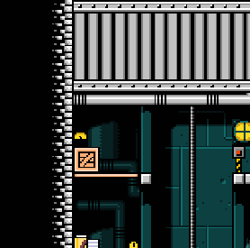
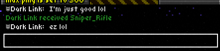
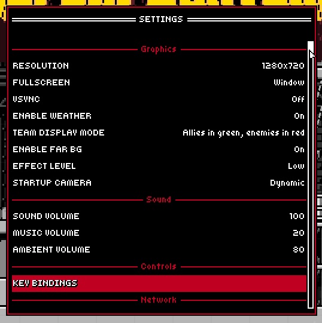

My own mod for [Superfighters Deluxe](https://store.steampowered.com/app/855860/Superfighters_Deluxe). 
- It adds some features I personally like to have in vanilla SFD. 
- Players without SFDCT can join you server, and you can join vanilla servers with SFDCT.

# Notable Features
> [!NOTE]
> The mod is still a work-in-progress. Features may break, be added, removed, or changed entirely.

### Sound Panning
- Sounds will pan to the left or right depending on where they come from
- Sound will distort and sound slowed down or speed up according to the time modifier.

### Vote-Kicking
- Players can start a vote-kick against another player and provide a short reason for it.
- After a vote, vote-kicking will not be available for some time. (3 minutes by default)
- Only players that have spent some time in the server can start a vote. (2 minutes old by default)

### More profiles
- You have twice the amount of profiles to use, from 9 to a whopping 18.

### More slots
> [!WARNING]
> This is feature is experimental and untested. It may break maps and scripts, or may also break on its own.
- Set more than 8 slots for players or bots to use in your server.
- Activated with the `-SLOTS [8-32]` start parameter.

### QoL and Customization
- Cycle through your messages in chat using the `UP` and `DOWN` arrow keys (like Minecraft!)

- Choose your own custom color for the UI.

# Installation
> [!WARNING]
> SFDCT may get flagged as malicious by your browser/OS. This is a **known problem**, however, due to this we advice you to **not** trust downloads of SFDCT's releases from sites outside the [Official Repository](https://github.com/Liokindy/SFDCT/).

1. Get the latest release [here](https://github.com/Liokindy/SFDCT/releases). Go to SFD's root folder and extract the zip contents there.

2. Go to SFD's launch options in Steam and type `/c "%command%\..\SFDCT.exe"`. This will tell Steam to open SFDCT instead of SFD.

3. When you launch SFD, you will get asked to choose between SFDCT, SFD or [SFR](https://github.com/Odex64/SFR) (if you have a release already installed). You can also skip this and start a game automatically by adding their corresponding start parameter. (`-SFDCT`, `-SFD`, or `-SFR`)

# Credits
SFDCT is made using [SFR](https://github.com/Odex64/SFR) as a base, however, assets, features, etc. From SFR are not included.

# Building
You can use [SFR's](https://github.com/Odex64/SFR) building guide, as the process is similar.