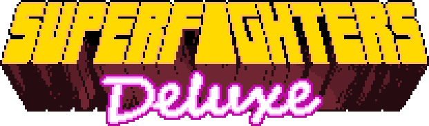
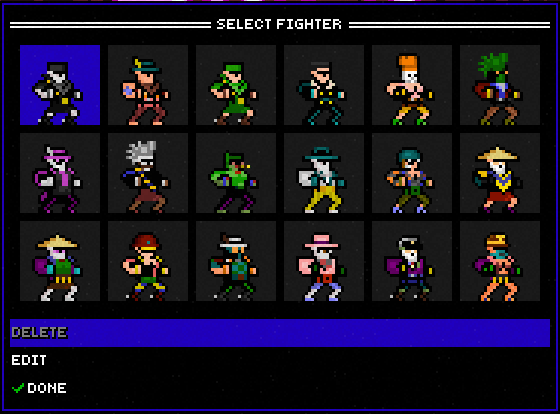
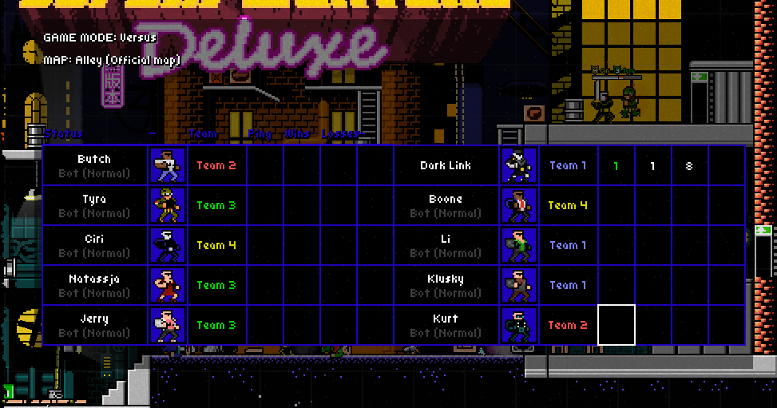
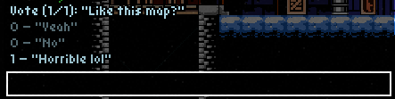
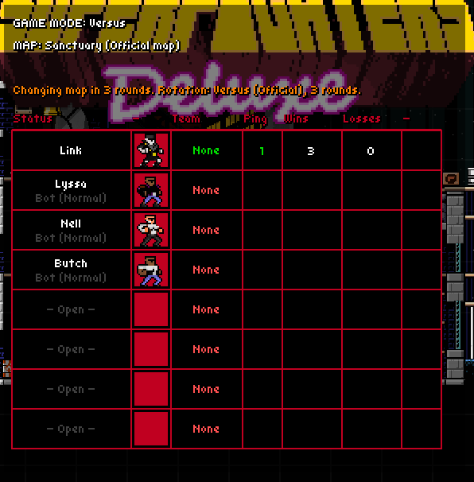
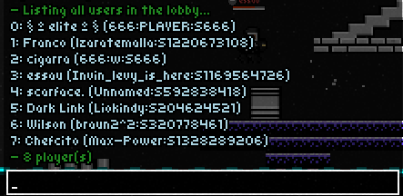
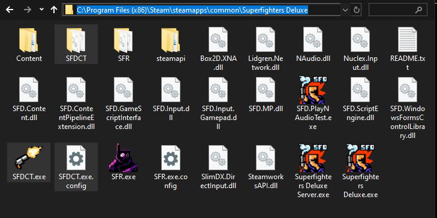
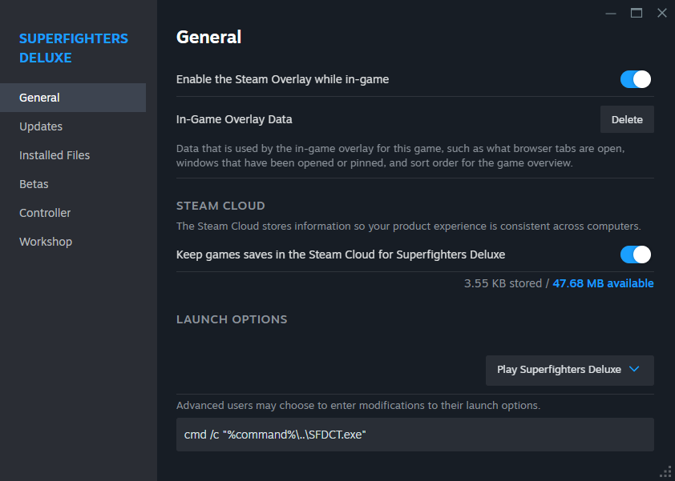

My own mod for [Superfighters Deluxe](https://store.steampowered.com/app/855860/Superfighters_Deluxe). Superfighters Deluxe Custom.

- It adds some features that I personally like to SFD. 
- Players without SFDCT can join your server, and you can join other vanilla servers while using SFDCT.

> [!NOTE]
> The mod is still a Work-In-Progress. Some features may be added, be removed, or sometimes changed drastically.

> [!TIP]
> Settings are currently accessed and changed by editing `SFDCT/config.ini` directly with a text editor. You can refresh your settings in-game using `F6`. In some cases you may need to restart the game.

# NOTABLE FEATURES

#### EXTENDED PROFILES
- You have twice the amount of profiles to use, 18 instead of just 9.

#### EXTENDED SLOTS
> [!WARNING]
> This feature may be *buggy*. Unprepared scripts/maps will behave weird with more than 8 players. Other players not using SFDCT will get incorrect results from `/PLAYERS` and the scoreboard will look empty.

- Set more than 8 slots for players and bots in your server using the launch parameter `-SLOTS`, you can also do a set amount like `-SLOTS 12`.
- A bigger scoreboard that shows more than 8 players, beware that because of the UI's fixed scale it may clip out of the screen in smaller resolutions than 720p.
- If you know a server uses SFDCT and has extended slots enabled, you can join with the same slot count to see the scoreboard properly.

#### MANUAL VOTES
- When the vote ends, the results are sent to you in private.
- You can specify up to 4 choices and specify if the results should be shown to everyone else.
- Examples: `/DOVOTE 1 "Like the map?" "Yeah" "No"`, `/DOVOTE "Kill Dxse?" "Yes" "Yeah" "Affirmative"`

#### CHAT IMPROVEMENTS
- Use the `UP` and `DOWN` arrow keys to cycle through old messages or commands.
- Use `Ctrl` + `Backspace` to erase entire words like other text editors.
- Moderators and the host can talk with each other privately using staff-chat (`/S` or `/STAFF`)

#### CUSTOM UI COLOR
- Use any color you want for the UI.

#### IMPROVED DEFAULT COMMANDS
- The `/PLAYERS` command will provide more info about the players in the lobby.

- The `/GIVE` command supports multiple arguments, i.e `/GIVE ME 17 21 BOUNCING_AMMO`

# INSTALLATION
> [!WARNING]
> SFDCT may get flagged as malicious. This is a known problem. We advice you to **NOT** trust downloads of SFDCT from sites that are not from [**this** repository](https://github.com/Liokindy/SFDCT/).

1. Download the [latest release](https://github.com/Liokindy/SFDCT/releases) and extract the contents to Superfighters Deluxe's folder. (Commonly located at `C:\Program Files (x86)\Steam\steamapps\common\Superfighters Deluxe`)

2. Go to SFD's launch options in Steam and type `cmd /c "%command%\..\SFDCT.exe"`.

3. When you launch SFD, SFDCT will boot instead.

# CREDITS
SFDCT is made using [SFR](https://github.com/Odex64/SFR) as a base, however, assets, features, etc. From SFR are not included.

# BUILDING
You can use [SFR's](https://github.com/Odex64/SFR) building guide, as the process is similar.