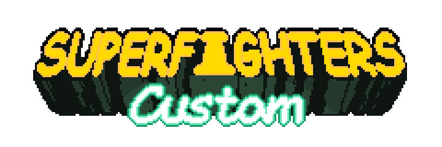

> [!CAUTION]
> SFDCT may get detected as a *malicious program*. This is a known problem.
>
> Do ***NOT*** download SFDCT from sources that are not [***THIS***](https://github.com/Liokindy/SFDCT/releases) official repository's releases.
>
> If you have doubts, you can manually review the source code and build SFDCT on your own PC.

Superfighters Custom is a mod for [Superfighters Deluxe](https://store.steampowered.com/app/855860/Superfighters_Deluxe). It adds and tweaks some features while mantaining compatibility with vanilla-SFD. Meaning that a player can join a normal SFD server with SFDCT, and players using normal SFD can join a server being hosted with SFDCT.

    
Why "SFDCT"? Why not "SFDC", or "SFC"?

*Yes, it is called "Superfighters CusTom" and abbreviated to "SFDCT", not "SFDC" or "SFC". [You wonder who did that? Me. I voted for it](https://youtu.be/981BU3u5imU?t=63). This was originally, believe or not, choosen to not sound like a big important mod (wow, its SFC!), and to not use [Odex's "SFDC" script](https://steamcommunity.com/sharedfiles/filedetails/?id=2379236732)'s name. The SFDCT team is NOT to be held responsible for any confusion on this matter as we hope our efforts are enough to differentiate us from these original creations. As of now, I have grown attached to the name, yeah it is technically wrong, but that gives it a bit of charm doesn't it?*
    

## Installation

> [!IMPORTANT]
> SFDCT releases will ***only*** work in the SFD version specified for that release, any other version of SFD may ***not*** work

1. **DOWNLOAD A RELEASE**

You can get the [latest **stable** release](https://github.com/Liokindy/SFDCT/releases/latest), or you can check if there's a [latest **pre-release**](https://github.com/Liokindy/SFDCT/releases) instead. Extract the contents to Superfighters Deluxe's folder.

2. **LAUNCH OPTIONS**

Inside Steam, go to Superfighters Deluxe's `Properties...` -> `LAUNCH OPTIONS` and copy these launch options:

    
    cmd /c "%command%\..\SFDCT.exe"

3. **OPEN SFD**

When you open Superfighters Deluxe, a console will open, inside you should see colored text.

## Credits

#### SFDCT

- Azure (Ideas)
- ElDou's1 (Ideas, Tester)
- Liokindy (Developer)
- Nult (Ideas)

#### SPECIAL THANKS
- Developers of [Superfighters Redux](https://github.com/Odex64/SFR)
- Original developers of [Superfighters Deluxe](https://mythologicinteractive.com/SuperfightersDeluxe)
